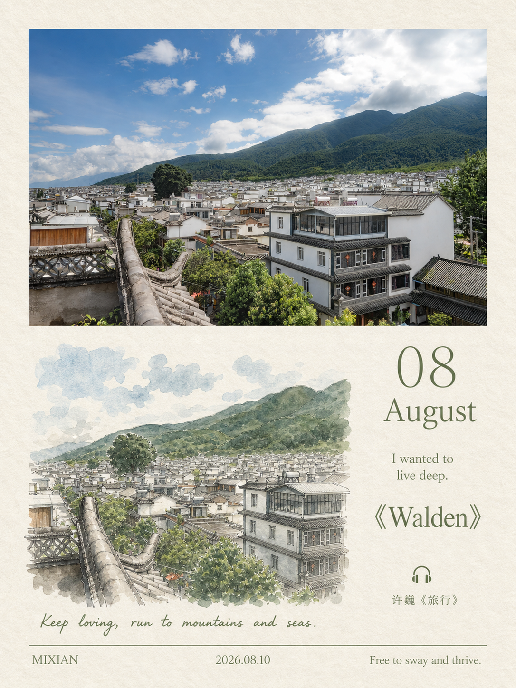
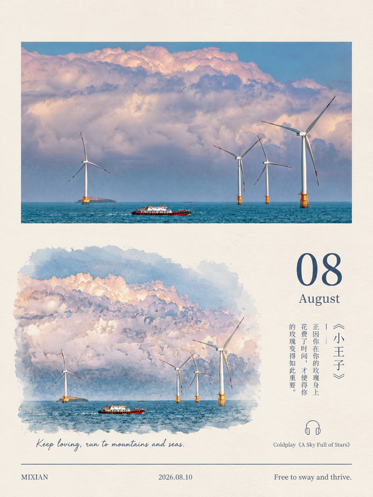
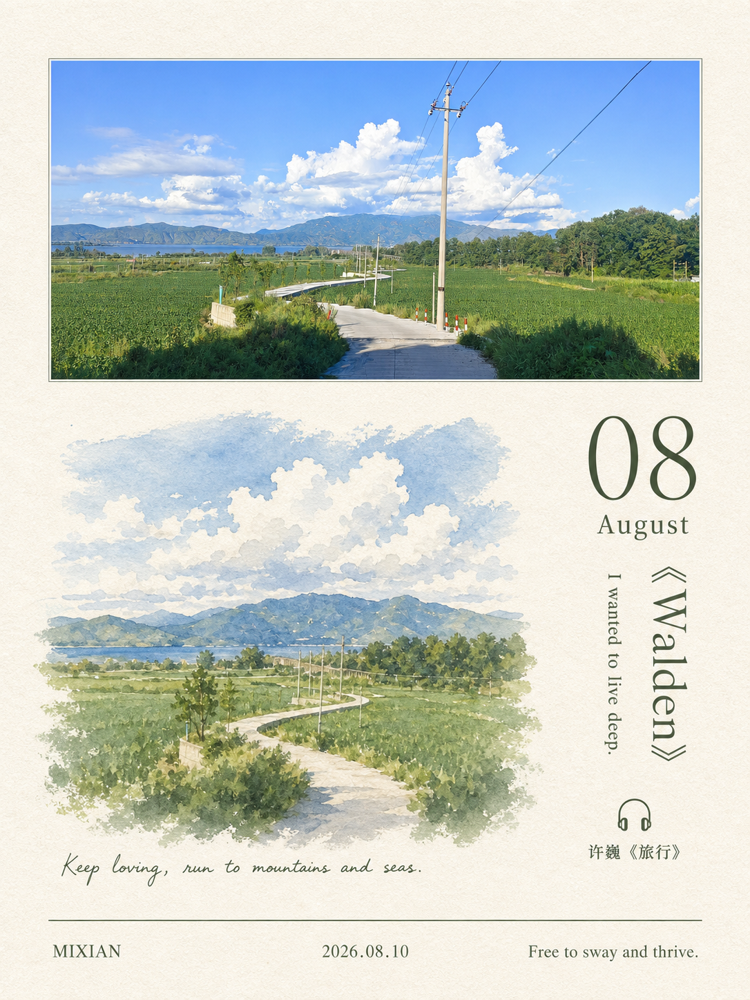

# Photo to Monthly Zine Postcard

Turn one photograph into a finished `3:4` monthly Zine postcard: preserve the whole photograph above, then build a compact watercolor monthly page below with image-matched literature and music.

## Quick install

Tell your Codex Agent:

```text
Please install the GitHub Skill `photo-to-monthly-zine-postcard`.
Repository: shenchangyi/photo-to-monthly-zine-postcard
Path: skills/photo-to-monthly-zine-postcard
```

The Skill turns one photo into a portrait `3:4` monthly Zine postcard: the original photo stays intact above, while the lower page adds a source-specific watercolor, curated literature, and matching music.

中文：把一张照片制作成一张具有月历感的 Zine 明信片。它会保留原图主体，再用自由边界水彩、右侧书签栏、书籍短句、歌曲和页脚完成一张克制的摄影记录卡。

## What this Skill protects

- Keep the original photo completely intact with proportion-safe `contain` placement.
- Route landscape, square, and portrait sources into a stable `3:4` postcard composition.
- Build the lower half as a **small horizontal monthly photography page**, never a second poster.
- Keep one free-edge, source-specific watercolor block on the left and a clean right-hand bookmark column.
- Research and verify a real book/quotation/song before generation; use an original caption or a blank music field when no source is suitable.
- Lock typography, whitespace, footer, and right-column hierarchy so a generated card stays editorial and restrained.

## Gallery

<p align="center">
  
  
  
</p>
<p align="center">
  
  
  
</p>
<p align="center">
  
  
</p>

## Install in Codex

Ask a Codex Agent to install this GitHub Skill folder:

```text
Install the GitHub Skill at:
https://github.com/shenchangyi/photo-to-monthly-zine-postcard/tree/main/skills/photo-to-monthly-zine-postcard
```

For an installer that accepts `owner/repo` and a path, use:

```text
repo: shenchangyi/photo-to-monthly-zine-postcard
path: skills/photo-to-monthly-zine-postcard
```

After installation, the Skill is available on the next agent turn as `$photo-to-monthly-zine-postcard`.

## Use it

Attach a photo and say, for example:

```text
Use $photo-to-monthly-zine-postcard to make this into a monthly Zine postcard.
```

You may also provide a month, handwritten line, author, date, footer copy, a preferred book, or a song. Supplied copy is treated as exact locked text.

## Repository layout

```text
skills/photo-to-monthly-zine-postcard/  # installable Codex Skill
  SKILL.md                              # workflow entry point
  agents/openai.yaml                    # Skill UI metadata
  references/                           # layout, curation, QA, full original rule document
  assets/                               # private visual layout anchor
examples/                               # completed postcard cases shown above
```

The full working rule document is preserved at [photo-to-zine-postcard-monthly-variant.md](skills/photo-to-monthly-zine-postcard/references/photo-to-zine-postcard-monthly-variant.md).

## Design contract

The intended result is a calm photography calendar record: the photo remains primary; lower artwork only extracts the scene relationship; the right column provides an editorial anchor rather than decoration. The complete layout specification and output gate live inside the Skill so the process is reusable, rather than depending on a one-off prompt.

## License

MIT. You may reuse, adapt, and share the workflow under the license terms.
